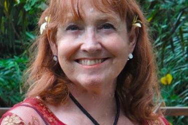

# About Santa Cruz Baroque Festival

## Mission Statement

Our mission is to present an annual season of early music as it sounded in its own time. We aim for artistic excellence while transmitting the joy of Baroque music to the community and to future generations by engaging our audience in an expedition through musical time.

## Vision Statement

Santa Cruz Baroque Festival envisions a community where all people have experienced the joy of music, and can understand the legacy and value of early chamber music in which a player traditionally creates a unique performance by structured improvisation.      

## Baroque Festival Core Values</h2>
* We present artistically excellent performances that are emotionally expressive, with chamber music performed in the improvisatory style in fashion when the music was new.
* We engage in education to audiences of all ages through our pre-concert talks, our concert notes, radio broadcasts, the ‘See Things in Context’ on our website, and in 2020, free weekly video live casts. Currently, we’re featured on KSQD’s Community Concert Hall.
* We engage in Youth Outreach and education through our Youth Chamber Music Competition, our Emerging Artist Showcase, our bilingual videos (in preparation), and our artists in classrooms.

## Founder, Former Artistic Director

### Linda Burman-Hall

The Santa Cruz Baroque Festival’s founding Artistic Director, Linda Burman-Hall, died suddenly on August 21, 2023 while attending a conference in Malaysia. It was her vision and boundless energy that has allowed SCBF to present excellent, historically informed performances of early music to the Santa Cruz community for decades. 

## Thank you for taking this journey with us!
