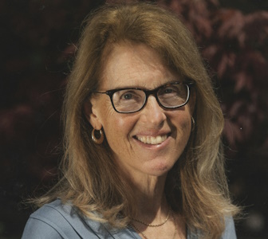
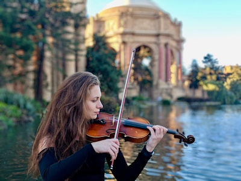

# Board of Directors

## Artistic Director (vacant)

The Santa Cruz Baroque Festival’s founding Artistic Director, Linda Burman-Hall, died suddenly on August 21 while attending a conference in Malaysia. It was her vision and boundless energy that has allowed SCBF to present excellent, historically informed performances of early music to the Santa Cruz community for decades. 

Even as we begin a search for a new Artistic Director to take the helm for the 2025 season, we dedicate the 2024 Season to Linda and her legacy. We invite you to participate in this recognition and celebration by renewing your financial support of SCBF. The first concert of the Festival will be followed by a reception for donors that will feature remembrances of Linda from those who knew her best.

## Co-President

Penny Hanna

## Co-President

Brian Johnston

## Vice-President

Chris Smith

## Financial Director

Rowan O’Neal

## Secretary

Donald Wilson

## Board members

Jill Perry

Dorothy Manzo

Ontario Alexander

Vlada Moran

Grijda Spiri

## General Manager

Kate Smit

Kate has worked in a number of management positions for start-up as well as established companies. She is originally from the east coast where she studied classical piano with Naomi Pollack from Juilliard and concert pianist Karen Goodin at Hartt Conservatory of Music. She has also studied with internationally acclaimed concert pianist Thomas Hansen in the Bay Area.

Currently Kate is an independent piano teacher who works with beginner to intermediate students. She is excited to have recently joined Santa Cruz Baroque Festival as General Manager.

## Assistant manager

Isabella Balbi

Isabella is a writer, radio DJ, and music enthusiast from Los Angeles.

She has a passion for non-profit media and has worked extensively in non-commercial radio as a staff member at KZSC Santa Cruz, in addition to working with independent music venues including The UC Theatre Taube Family Music Hall.

She is eager to continue to create opportunities for communities to connect through music, and is especially excited to work towards the Santa Cruz Baroque Festival’s mission of preserving musical and cultural traditions