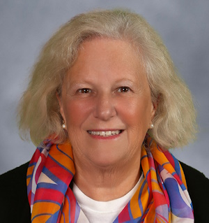
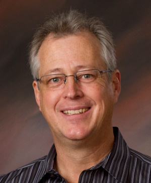

# Artistic Director

### Jörg Reddin

Baroque Festival audiences were first introduced to Jörg Reddin in the 2024 season, when as Artist in Residence he directed and performed on the first four concerts of the Festival. Audiences enthusiastically responded to Maestro Reddin's insightful programing and virtuosity on the organ as well as his warm bass-baritone voice.  His infectious enthusiasm for Baroque music and easy rapport with the audience were evident throughout his four concerts. 

# Board of Directors

## President

### Vlada Moran

## Vice-President Artistic Affairs 

### Chris Smith

## Vice President of Development

### Dorothy Manzo

## Treasurer

### Donald Wilson

## Secretary

### Ontario Alexander

## Board members

### Jill Perry

### Judy Roberts

### Penni Bengtson

### Keith Swenson

### Brian Johnston

