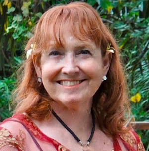
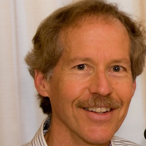

# Board of Directors

## Founder, Former Artistic Director

### Linda Burman-Hall

The Santa Cruz Baroque Festival’s founding Artistic Director, Linda Burman-Hall, died suddenly on August 21 while attending a conference in Malaysia. It was her vision and boundless energy that has allowed SCBF to present excellent, historically informed performances of early music to the Santa Cruz community for decades. 

## Artistic Director

### Jörg Reddin

Our audiences have enthusiastically responded to Jörg Reddin's insightful programing, emotional range and exceptional people-friendly accessibility before, during, and after his four concerts earlier in the 2024 season.

It was Linda Burman-Hall's desire in 2023 to bring Jörg Reddin, organist and bass-baritone of Bach's own church in Arnstadt Germany for our 2024 season, celebrating the legacy of J.S. Bach here in Santa Cruz. It is now our honor to continue her vision. As Linda worked tirelessly for over 50 years to bring exceptional performances and creative concerts to our community, it is our hope you will share this expedition through musical time next Season, our 52nd, with our new Artistic Director: organist, bass-baritone & conductor Jörg Reddin.

## Co-President

### Vlada Moran

## Co-President

### Brian Johnston

## Vice-President Artistic Affairs 

### Chris Smith

## Vice President of Development

### Dorothy Manzo 

## Secretary

### Donald Wilson

## Financial Director

### Rowan O’Neal

## Board members

### Jill Perry

### Judy Roberts

### Max Schmeder

### Ontario Alexander

## General Manager

### Kate Smit

Kate has worked in a number of management positions for start-up as well as established companies. She is originally from the east coast where she studied classical piano with Naomi Pollack from Juilliard and concert pianist Karen Goodin at Hartt Conservatory of Music. She has also studied with internationally acclaimed concert pianist Thomas Hansen in the Bay Area.

Currently Kate is an independent piano teacher who works with beginner to intermediate students. She is excited to have recently joined Santa Cruz Baroque Festival as General Manager.

## Assistant manager

### Isabella Balbi

Isabella is a writer, radio DJ, and music enthusiast from Los Angeles.

She has a passion for non-profit media and has worked extensively in non-commercial radio as a staff member at KZSC Santa Cruz, in addition to working with independent music venues including The UC Theatre Taube Family Music Hall.

She is eager to continue to create opportunities for communities to connect through music, and is especially excited to work towards the Santa Cruz Baroque Festival’s mission of preserving musical and cultural traditions

