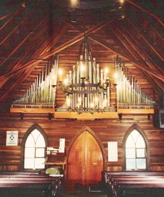

# Boomeria Lives On!

For the last few decades, the Santa Cruz Baroque Festival has made a visit to Preston Boomer’s amazing performance space in Bonny Doon, complete with pipe organ in a little chapel nestled in the redwoods. Boomeria has become an annual summer fundraising event, with accomplished musicians performing on the pipe organ, and the audience invited for an organ crawl inside the workings.

Sadly, time and fires have brought an end to this delightful retreat. This season, we celebrate Boomeria at St. Andrews Episcopal Church. The church organ was specially built and installed for St. Andrew's by Preston Boomer in 1960. The beautiful glass Phoenix window above the organ is a testament to Preston’s energy and generosity for so many years. Thank You Preston!

All proceeds from this performance go the fundraising efforts of The Santa Cruz Baroque Festival (SCBF). SCBF is a tax-exempt 501(c)(3) arts organization funded by your individual donations, ticket sales, and grants.

## Saturday July 13, 2024 1-5 pm

* St. Andrews Episcopal Church
* 101 Riverside Ave, Ben Lomond, CA 95005

Program: Selections to be announced by the artist.

* Bill Visscher ~ pipe organ
* Bruce Sawhill ~ pipe organ
* Robert Jackson ~ pipe organ
* Jesse McMilan ~ pipe organ, piano
* Martin Gaskell ~ pipe organ

The Santa Cruz Brass Quintet
* Leonard Moore, Trumpet
* Mark Joiner, Trumpet
* Ken Weisner, Horn
* Charlie McDowell, Trombone
* Scott Wilkinson, Tuba

Bonny Doon Baroque & Crumhorn Extravaganza
* Music for violin, viols, harpsichord, crumhorns.
* Martin Gaskell ~ Barbara Gaskell ~ Helen Gibbons ~ Scott Wilkinson
* Penny Hanna ~ Laura Gaskell

Santa Cruz Historical Fencing
* Historical Swordplay Lecture and Demonstration with Rowan O’Neal and Van Swanson

Irish Dancers “Wings of Fire”
* led by Michael Murphy and
* Accompanied by Crooked Road
* with Julie Horner

