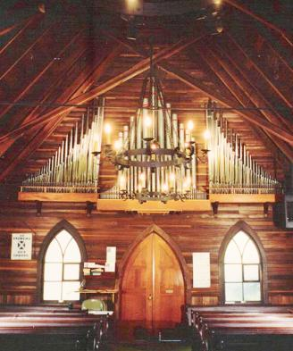

# Boomeria Lives On!

Join us for a festive musical happening at our yearly Boomeria fundraiser at the enchanting St. Andrews Church of Ben Lomond and meet Artistic Director Jörg Reddin who’s coming from Arnstadt, Germany. Saturday, July 11, 1-4 PM. Wine and gourmet food served. This is a happy summer prelude to our upcoming 54th season.

## Background

For the last few decades, the Santa Cruz Baroque Festival has made a visit to Preston Boomer's amazing performance space in Bonny Doon, complete with pipe organ in a little chapel nestled in the redwoods. Boomeria has become an annual summer fundraising event, with accomplished musicians performing on the pipe organ, and the audience invited for an organ crawl inside the workings.

Sadly, time and fires have brought an end to this delightful retreat. This season, we celebrate Boomeria at St. Andrews Episcopal Church. The church organ was specially built and installed for St. Andrew's by Preston Boomer in 1960. The beautiful glass Phoenix window above the organ is a testament to Preston's energy and generosity for so many years. Thank You Preston!

All proceeds from this performance go the fundraising efforts of The Santa Cruz Baroque Festival (SCBF). SCBF is a tax-exempt 501(c)(3) arts organization funded by your individual donations, ticket sales, and grants.

* [Boomeria tickets](https://www.instantseats.com/index.cfm?fuseaction=buy.event&eventID=5AEC1FA6-F619-BD88-AACE48CB89EA4887)

## Saturday, July 11th, 1-4 pm, 2026

* St. Andrews Episcopal Church
* 101 Riverside Ave, Ben Lomond, CA 95005

Program: Selections to be announced by the artist.

* Organists: Bill Visscher, Ethan Williams, Bruce Sawhill, Jesse McMilan, and Vlada Moran
* Scott Wilkinson with SC brass ensemble.
* Penny Hanna, viola da gamba

