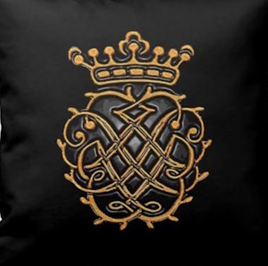

# 2018 Season

**45 years of concerts in Santa Cruz!**
 
## Concert 1 - Cupid's Gift
### Love Songs & Enchantments

* Saturday February 10, 2018
* 7:30 P.M.
* UCSC Music Recital Hall

Traveling all the way from England to bring you the experience of falling in love—one of a beating heart and a quick smile—soprano Elizabeth Hungerford will enchant you. Enjoy gentle plucked strings that carry you through simple songs of romance, marked with dignified harpsichord accompaniment. Elizabeth performed in 2016 and the audience then fell in love with her expressive voice, witty engagement, and tremendous musicianship. With Valentine's Day around the corner, this is a concert that cannot be missed.

* Elizabeth Hungerford, soprano
* Hideki Yamaya, 10-course Renaissance lute
* Linda Burman-Hall, harpsichord & virginal

## Concert Two
### 500th Birthday Celebration – Medici Codex

* Saturday March 3, 2018
* 7:30 P.M.
* Holy Cross Church

Take a moment to consider the best wedding present you've ever given. Then consider coming to this performance of music from the Medici Codex, a choir-book gifted exactly 500 years ago to Pope Leo X's nephew. The book was collected from the best composers of the Renaissance, and stands the test of time due to the stunning nature of the vocal music. These sacred compositions were written during a time of political strife and represent some of the challenges and beauty of the time. You will hear voices leaping in and out of one another, a big, moving sound, per- formed by four separate ensembles who have come together to celebrate this unique collection of music.
 
* Ariose, conducted by Camille Couture
* UCSC Chamber Singers, conducted by Michael McGushin
* San Francisco Renaissance Voices, conducted by Katherine McKee

## Concert Three
### The Musical Offering – J. S. Bach

* Sunday April 8, 2018
* 3:00 P.M.
* UCSC Music Recital Hall

In 1747 J.S. Bach visited Potsdam, where the Emperor Frederick challenged him to prove his musical ability by immediately improvising on a theme composed by the Emperor himself. Bach's genius prevailed, and this collection of canons and fugues are the result. This intricate music exemplifies the counterpoint nature of the challenge, with notes choreographed against one another in the “classic rock” style of High Baroque. This concert includes other works of Bach, and invites you to step into the heart of the dark, dramatic challenge of an Emperor.

* Edwin Huizinga, Baroque violin
* Lars Johannesson, traverso flute
* David Morris, Baroque cello
* Linda Burman-Hall, harpsichord

 

## Concert Four
### Trading Gifts – Iberia & the Arab World

* Sunday April 29, 2018
* 3:00 P.M.
* UCSC Music Recital Hall

Spanish and Moorish music, from Martinetes to Sevillanas and Fandangos. Featuring classical preludes by the Tunisian master Jassar Haj Youssef (viola d'amore) and Algerian master Mustafa Skandrani (fortepiano) and a Rococo sonata by Domenico Scarlatti played on viola d'amore with harpsichord.

* Leslie Hirsch, 7-string viola d'amore
* Linda Burman-Hall, harpsichord and fortepiano
* Carlitos de Santa Cruz, cante flamenco
* El Duquete, guitar

 
## Concert Five
### Eternal Baroque – New Music in Old Styles

* Saturday May 12, 2018
* 7:30 P.M.
* Peace United Church of Christ

Baroque music is, in some ways, familiar to us all. There are melodies and musical styles that were revolutionary in their time but merely commonplace to our modern ears. This concert seeks to take these time-honored styles and make them new again, to allow the audience to experience how ground-breaking these musical statements once were. Original works in High Baroque style by celebrated living composers Nicola Canzano, Martin Gaskell, Willem Ceuleers and others, including the cash prize winners of the Baroque Festival Bach Chorale Competition.

* Vicki Melin, traverso flute
* Lynn Tetenbaum & David Morris, violas da gamba
* Vlada Moran, pipe organ
* Nicola Canzano, harpsichord
* UCSC Vocal Octet, conducted by Michael McGushin
