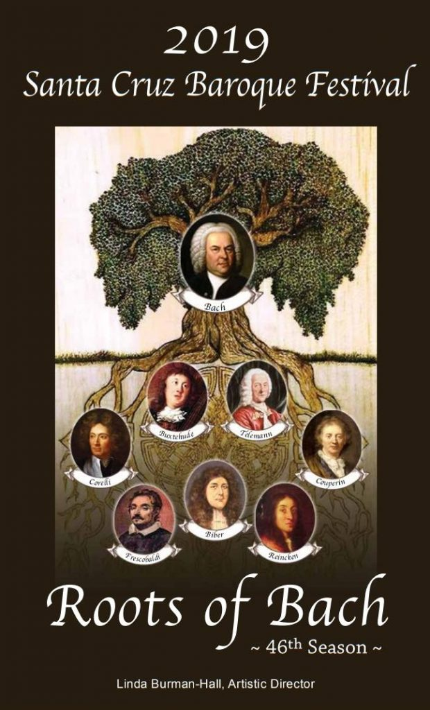
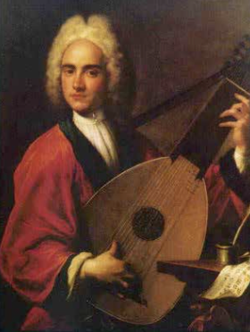
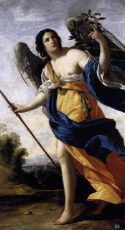
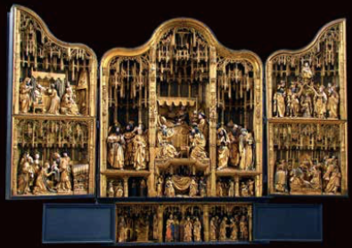
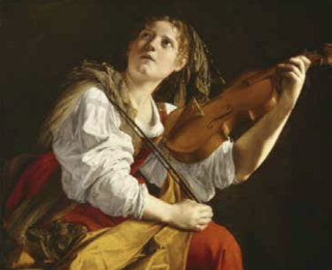
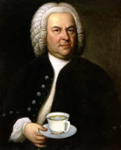

# 2019 Season

## Roots of Bach

## I: The King of Instruments in the Age of Bach

* Saturday, February 9, 2019 – 7:30pm
* UCSC Recital Hall

John Schneiderman, Baroque Lute

Regarded as the noble instrument of Kings and Queens, the lute, a plucked stringed instrument, rose from its Medieval and Renaissance roots to its greatest development and appreciation during the High Baroque in Germany. Sylvius Leopold Weiss, J. S. Bach's direct contemporary and friend, had command over all other lutenists and lute composers. Our opening offers seductions and guilty pleasures for 13-course High Baroque lute by Bach, Weiss, Adam Falckenhagen and Johann Kropfgans.

A meet-the-artist reception follows for donors and subscribers.
A pre-concert talk begins 45 minutes before each concert.

## II: Roots of Bach & Telemann

* Sunday March 3, 2019 – 3pm
* UCSC Recital Hall

The Virtu Ensemble:
* Claudia Gantivar, Recorder
* Angelique Zuluaga, Soprano
* Cynthia Black, Violin
* Frederic Rosselet, Cello
* Bernard Gordillo, Harpsichord

Revel in the sensuous early and mid-Baroque Italian melodies of Frescobaldi and Corelli that Bach spent his youth emulating, along with glorious chamber works and a joyous cantata by his best friend Georg Phillip Telemann.
A pre-concert talk begins 45 minutes before each concert.

## III: A North German Abendmusik with Bach
* Saturday, March 23, 2019 – 7:30pm
* Peace United Church of Christ

Margaret Martin Kvamme, Organ
Vlada Moran, Organ

The Abendmusik public concerts in the candlelit Marienkirche in Lübeck, played by the organ virtuoso Dietrich Buxtehude, were a fascination to the 20-year-old J. S. Bach. He is said to have walked 280 miles each way to hear Buxtehude, and angered his employer back home because he stayed several months “to comprehend one thing and another about his art”. We share Bach's fascination with the kaleidoscopic effects of not only Buxtehude but also of Abendmusik founder Franz Tunder, another colorful figure of the early North German baroque. Two virtuoso organists play masterworks such as Bach's Toccata & Fugue in D Minor along with seldom-heard treasures by Bach's teachers Johann Adam Reincken, Georg Böhm and Nicolaus Bruhns.
A pre-concert talk begins 45 minutes before each concert.

## IV: Bach & the Virtuoso Violin

* Sunday April 14, 2019 –  3:00pm
* UCSC Recital Hall

Performed by
* Edwin Huizinga, Baroque violin
* Lynn Tetenbaum, Viola da Gamba
* Linda Burman-Hall, Harpsichord
 
Join us for a walk through the dark and secret heart of the Baroque. Keep your mind balanced on that daring knife-edge of unaccompanied violin tone ~ Heinrich von Biber in his Passacaglia in the 1670s and half a century later J. S Bach in his Chaconne take innumerable risks in building thrilling chords and counter-melodies for a single brave player to deliver. After all the solo miracles, we'll conclude the evening with buoyantly optimistic mid-Baroque trios for violin, harpsichord and obbligato viol by Bach's Danish-German hero, Dietrich Buxtehude.
 
 
A pre-concert talk begins 45 minutes before each concert.
 
## V: Bach's Coffeehouse

* Saturday, May 4, 2019 – 7:30pm
* UCSC Recital Hall 

Performed by
* Sheila Willey, Soprano as Lieschen, a young coffee-addict
* Jonathan Schmucker, Tenor as the Narrator
* Ben Brady, Bass-Baritone as Herr Schlendrian, the vengeful father
* Lars Johannesson, Baroque Flute, with The Festival Baroque Strings
* Linda Burman-Hall, Director and Harpsichord
 

By the 1720s, thrill seekers all over Europe were seduced into indulging in coffee, which proved to be utterly addictive to both sexes, leading to the establishment of coffee-houses with musical entertainments. In 1729, J. S. Bach took over the lively social music scene at Zimmerman's Coffeehouse in Leipzig, where his Collegium students gave informal concerts. Coffee-addiction led to many a family quarrel, as chronicled in Bach's hilarious Coffee-Cantata, which we'll memorably perform. Toward the end of Bach's 20 years at the coffeehouse, a promising young composer was on the scene: Johann Goldberg! Don't miss this rare chance to hear his remarkable music!

A meet-the-artist reception follows for donors and subscribers.
 
A pre-concert talk begins 45 minutes before each concert.

### Anonymous 18th Century painting

thought to be Sylvius Leopold Weiss

### Allegory of Virtue

ca 1634 by Simon Vouet (1590—1649) Musée du Louvre, Paris

### Interior of the Antwerp Altarpiece

from Marienkirche, Lübeck, 1518–22
 

 
### Young Woman with a Violin 

(Saint Cecilia, Patroness of Music, ca. 1612) by Orazio Gentileschi (1562—1639), Detroit Institute of Arts
 

### Portrait of J. S. Bach

ca 1745 by Elias Gottlob Haussmann (1695–1774), caffeinated The Bach Archive, Leipzig, Germany

