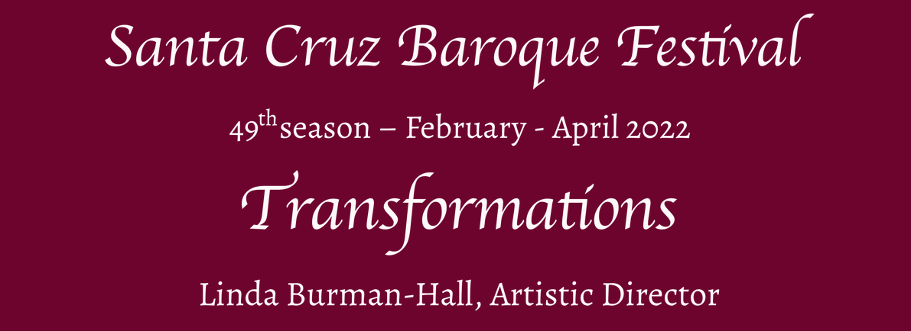
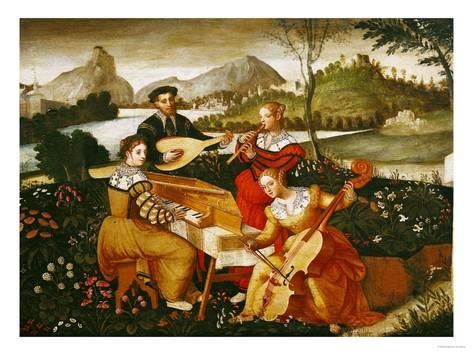

# 2022 Season

## I. Think Clearly My Heart

* Saturday, February 5
* 7:30pm
* Messiah Lutheran Church

Performers:
* Bethany Hill, soprano
* Linda Burman-Hall, harpsichord
* Erik Andersen, viola da gamba

Portrait of a Young Woman, Sandro Botticelli, 1485.

Bethany Hill —  a sensational new arrival in the Bay Area from her triumphs on the Australian opera and concert stage —  approaches early and contemporary music alike with an open mind and fresh ears.  Through her effortless command of an impossibly high register, she delights in evoking powerful emotional responses from audiences through her performances. 

“spellbinding” - Adelaide Theatre Guide

“just breathtaking” - Australian Stage

“triumphant” - Broadway World

## From Hotteterre to Hotter Jazz

* Sunday, February 27
* 5:00pm
* Peace United Church

Performed by:
* Lars Johannesson & Alissa Roedig, Baroque flutes
* Linda Burman-Hall, harpsichord
* Erik Andersen, viol
* Paul Contos, Jazz Sax and Flute
* Jeff Buenz, guitar
* Steve Max Robertson, drums

Cover of Jacques-Martin Hotteterre's Méthode de Musette (1738), engraving by Bernard Picart, Bibliothèque National, Paris transformed with spiral keyboard and background by L. Burman-Hall and P. Bryan (2021).

Jacques-Martin Hotteterre (1674-1763), the foremost member of the great French dynasty of renowned Baroque woodwind instrument makers, players and composers, told the world his secrets on how to play the wooden flute (France's most popular instrument) as well as how to improvise successfully in his 1707 Opus 1 treatise.

Now three centuries later, with Hotter Jazz as the music of our own time, we apply Hotteterre's improvisational ideas creatively in jazz style, working from similar foundations.

## Midseason Fundraiser Transformation Through Hope

* Sunday March 6
* 4:00pm
* Holy Cross Parish Hall

oin us for an afternoon of Medieval entertainment and elegant conviviality at Holy Cross's Parish Hall, with its breathtaking views of Santa Cruz and a spacious and well ventilated interior. Delightful snacks and wonderful wine provided by Hallcrest Vinyards will enhance the afternoon's mood. Concordian Dawn, ensemble for medieval music, specializes in twelfth- through fourteenth-century vocal repertoire, drawing on primary source material and focusing on socio-philosophical similarities between texts from centuries ago and the mindset of modern society. In so doing, Concordian Dawn produces a musical experience accessible to contemporary audiences, relating the human condition of the past to the familiar experiences of the present.

* Pre-sales: $50
* At door: $60

## III. Bash: Pipe Organ Transformations

* Sunday March 20
* 4:00pm
* Peace United Church

Vlada Moran, solo Pipe Organ

Charles Fisk Pipe Organ (opus 85), Stanford Memorial Chapel, in Bach temperament with added keys, 1984.

J. S. Bach learned by copying and arranging the works of all those composers he admired and wished to emulate. Especially he valued the Italian works that he could borrow (or steal) from the library of his elder brother. Come hear treasures by Marcello, Vivaldi and unknown masters that Bach delighted in playing on organ as models for his own work.

## IV Scarlatti: Spanish Harpsichord Folk to Classical

* Sunday April 10
* 4:00pm
* Holy Cross Church

Lillian Gordis, solo Harpsichords

Portrait of Domenico Scarlatti by Domingo Antonio Velasco, ca 1739 after he was awarded the Cross of the Order of Santiago from King João V of Portugal.

Based in Paris, the American virtuoso harpsichordist Lillian Gordis is quickly building an international reputation as an interpreter of the works of Domenico Scarlatti, the Italian composer-performer commanded to follow Princess Maria Barbara da Bragança at the time of her 1720 marriage into the Spanish court. The result 555 amazing sonatas for harpsichord solo, many of them based on folkloric Spanish material Scarlatti heard as various delegations visited his royal pupil.

## V. Transformed Bach

* Sunday April 24
* 4:00pm
* Holy Cross Church

Performers
* Alissa Roedig, Baroque flute
* Edwin Huizinga & Grijda Spiri, Baroque violins
* Erik Andersen, viol & Baroque ‘cello
* Linda Burman-Hall, Harpsichord, Director

Portrait of J. S. Bach holding puzzle canon by Elias Gottlob Haussmann (ca 1745), The Bach Archive, Leipzig, Germany, transcribed and transformed.

Eventually all sound-streams lead to Bach, whose name in German literally does mean ‘stream', the joining of cooperating currents flowing confidently and with force. Our all-transcriptions concert takes place in candlelight, while the metaphorical light we shine on familiar works is quite new. Expect to hear Bach with new ears. Perhaps the most famous Bach organ work, the D Minor Toccata and Fugue, known for more than 250 years as an organ work, is heard now as it might have been conceived, as a work for unaccompanied violin.

An on-site meet-the-artists reception follows for fully vaccinated donors and season ticket holders.

## Music in the Garden

* Sunday, May 8, 2022 ~ 1:00-5:00pm

Join us as we visit the lush tropical-look garden of our Artistic Director on the banks of the San Lorenzo River. Enormous redwoods, exotic palms and dozens of colorful Japanese maples and other exotic Asian trees surround an enormous koi pond. Our ‘Music in the Garden' is always held on Mother's Day to welcome those who want to honor their mothers, those who are mothers, as well as those who simply seek exquisite musical and culinary diversions on a pleasant weekend in a lovely setting that is safe and convenient. We promise traditional gourmet food-treats: omnivore, vegetarian, and vegan finger-foods served safely; local wines, sparkling and still mineral waters, soft drinks, and especially we promise an intriguing variety of memorable music in a changeable garden like no other.

~ Pre-sales: $50 ~At door: $55

Italian anonymous 16th century. Painted panel Musée de l'Hôtel Lallemant, Bourges, France. Partial.

## Emerging Artist Showcase

* Sunday, May 22, 2022 ~ 7:00pm ~ Holy Cross Church

Our 9th annual presentation features the top laureates of our Youth Chamber Music Competition. The 2022 winners will perform a variety of Baroque and Classical music, and receive their cash awards onstage. We're certain you'll be amazed at the quality of our winners. Year after year, the winners of Santa Cruz Baroque Festival's Youth Chamber Music far exceed the limited expectations some may hold. Simply put, young musicians can yet be astonishing performers. Guided in their interpretation by experienced coaches who are themselves wonderful musicians, they are capable of communicating musical ideas of the masters with great fluency, responsiveness, and grace. Combining the vigor and enthusiasm of youth and a spirit of healthy competition, the Showcase presents an afternoon of breathtaking performances. It is also a chance to support the festival and its efforts to uplift emerging artists.

Guaranteed to be memorable and inspiring! Admission FREE ($10 donation requested)

Anonymous 18th Century engraving of J. S. Bach's student collegium

