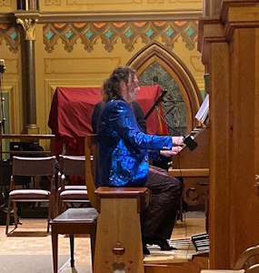
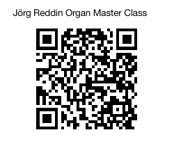
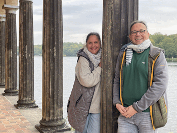
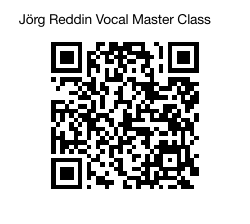
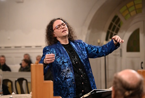
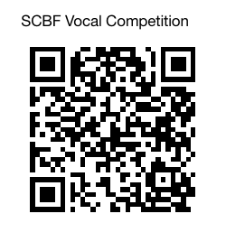
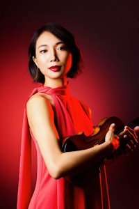

# 2026 - Essentially Baroque

Welcome to the 53rd year of the Santa Cruz Baroque Festival "Essentially Baroque" featuring exciting and insightful programs created by our Artistic Director Jörg Reddin. Exploring the essence of music in a bridge across time, Maestro Reddin brings us an incredible season of solo and chamber concerts, masterclasses, a vocal competition, and even a special family concert. Join us for Jörg's triumphant return to Santa Cruz from the Bach Church in Arnstadt Germany.

## Season Schedule

|                        |            |            |           |
|---------------------------------------|------------|------------|-----------|
|**[Musical Stories of Brass and Organ](#fundraiser-musical-stories-of-brass-and-organ)**  | Saturday | January 31 | 4 pm    |
|I. **[Themes and Variations](#concert-i-themes-and-variations)** | Sunday | February 8 | 4 pm |
|**[Organ Master Class Led by Jörg Reddin](#organ-master-class-led-by-jörg-reddin)** | Sunday | February 15 | 4 pm |
|II. **[Baroque Songs and Arias](#concert-ii-baroque-songs-and-arias)** | Saturday | February 21 | 7 pm |
|**[Vocal Masterclass Led by Jörg Reddin](#vocal-master-class-led-by-jörg-reddin)** | Sunday | February 22 | 3-5 pm |
|**[2nd Youth Vocal Music Competition](#2nd-youth-vocal-music-competition)** | Friday | February 27 | 3-5 pm |
|III. **[Baroque Festival meets Family](#concert-iii-baroque-festival-meets-family)** | Sunday | March 1 | 4 pm |
|IV. **[Secular and Sacred Vocal Music](#concert-iv-secular-and-sacred-vocal-music)** | Saturday | March 7 | 6 pm |
|V. **[All Bach Solo Violin](#concert-v-all-bach-solo-violin)** | Saturday | April 25 | 7:30 pm |
|  |   |   |  |
|X. **[Boomeria](../boomeria/)** | Saturday | July 11th | 1-4 pm |

&nbsp;

&nbsp;

----

### Fundraiser: Musical Stories of Brass and Organ
* Saturday, January 31, 4:00 pm
* Calvary Episcopal Church, 532 Center St, Santa Cruz

Combining music and short stories, Join us on a journey through the early Baroque Era with pieces from Gabrieli, Scheidt, Charpentier and Bonelli.

Performers:
* Jörg Reddin, Organ
* Santa Cruz Brass Quintet

&nbsp;

----

### Concert I: Themes and Variations
* Sunday, February 8, 4:00 pm
* Holy Cross Church, 126 High St, Santa Cruz, CA 95060

The preeminent and virtuosic interpreter of German Baroque Jörg Reddin triumphantly returns to Santa Cruz in yet another masterful solo organ recital with the program of variations, chaconnes, and passacaglia of Sweelinck, Böhm, Couperin, and Bach, including two newly discovered and authenticated Bach masterpieces, BWV 1178 and 1179.

Reception for donors in the Holy Cross Hall 6 pm

&nbsp;

----

### Organ Master Class Led by Jörg Reddin
* Sunday, February 15, 4:00 pm
* Calvary Episcopal Church, 532 Center St, Santa Cruz

Organ Masterclass led by Jörg Reddin on a Schoenstein Opus 84, two-manual Pipe Organ.

Send your intent of participation to Vlada Volkova-Moran at vladamuse@sbcglobal.net, and the payment of $50 by February 15th

* by check to: P.O. Box 482, Santa Cruz, CA 9506
* by [PayPal](https://www.paypal.com/ncp/payment/QWNMZHHLW9E2U)

The Masterclass is open to the public and free to observe.

&nbsp;

----

### Concert II: Baroque Songs and Arias
* Saturday, February 21, 7 pm
* Calvary Episcopal Church, 532 Center St, Santa Cruz
* Britta Schwarz, Jörg Reddin 

Join us for an enchanting evening as Festival Artistic Director/vocalist Jörg Reddin and guest artist, renowned German Contralto, Britta Schwarz, weave an intimate setting by candlelight in the historic Calvary Episcopal Church featuring Baroque songs and arias of Händel, Bach, Mozart, and others.  

 Mr. Reddin has collaborated with Ms. Schwarz for many years, and we are honored to welcome her to Santa Cruz for a series of special appearances.  Learn more about Britta Schwarz from her bio from a [past appearance with the San Francisco Symphony](https://www.sfsymphony.org/Data/Event-Data/Artists/S/Britta-Schwarz).

&nbsp;

----

### Vocal Master Class Led by Jörg Reddin and Britta Schwarz
* Sunday, February 22, 3-5 pm
* Trinity Presbyterian Church, 423 Melrose Ave, Santa Cruz

Send your intent of participation to Vlada Volkova-Moran at vladamuse@sbcglobal.net , and the payment of $50 by February 15th

* by check to: P.O. Box 482, Santa Cruz, CA 9506
* by [PayPal](https://www.paypal.com/ncp/payment/KXLLJB2GDJEZA)

The Masterclass is open to the public and free to observe.

&nbsp;

----

### 2nd Youth Vocal Music Competition
* Friday, February 27, 3-5 pm
* Trinity Presbyterian Church,  423 Melrose Ave., Santa Cruz

Open to vocalists aged 14-26 (as of competition date) who are residents of Santa Cruz, San Mateo, Monterey, Santa Clara, or San Benito counties.  There are monetary prizes.  1st place winner will have a performance opportunity at a future Santa Cruz Baroque Festival Concert.

See additional details on the [Youth Vocal Music Competition](../youth2) page.

&nbsp;

----

### Concert III: Baroque Festival meets Family
* Sunday, March 1, 4 pm
* Peace United Church, 900 High St, Santa Cruz, CA 95060

Bring the kids and yourselves for a family-themed afternoon to experience the magic of Prokofiev’s fairy tale "[Peter and the Wolf](./SCBaroque26-PeterandtheWolfFlyer.pdf)", where a courageous boy, a chatterbox bird, a waddling duck, and a crafty cat outsmart a hungry wolf. This enchanting work is designed to introduce children to the instruments of the orchestra with each character represented by a specific instrument.

Narrated by UCSC’s Michael McGushin with Artistic Director Jörg Reddin recreating the orchestra on the organ.

This event includes a special discounted children’s ticket price of $10 for persons under 18.

Performers:
* Jörg Reddin, Organ
* Michael McGushin, Narrator

&nbsp;

----

### Concert IV: Secular and Sacred Vocal Music
* Saturday, March 7, 6 pm
* Peace United Church, 900 High St, Santa Cruz, CA 95060

Enjoy a splendid evening of blended secular and sacred vocal music featuring outstanding soloists joined by the UCSC Chamber Choir, followed by a reception.

Performers:
* Jörg Reddin, Bass
* Britta Schwarz, Alto
* Jennifer Paulino, Soprano
* Michael Jankosky, Tenor 
* Jonathan Salzedo, Basso Continuo
* Alexa Pilon, Cello
* Roy Whelden, Bass
* UCSC Chamber, Choir

Reception 8 pm

&nbsp;

----

### Concert V: All Bach Solo Violin

* Saturday, April 25, 7:30 pm
* Calvary Episcopal Church, 532 Center St, Santa Cruz

Star violinist Nancy Zhou, lauded for her probing musical voice and searing virtuosity, will present half of JS Bach's sonata and partita cycle for solo violin. She will perform the first partita sandwiched by the G-minor and A-minor sonatas. Among her many laurels, Nancy won first prize at Shanghai’s Isaac Stern International Violin Competition.

Performers:
* Nancy Zhou, Violin

&nbsp;

----